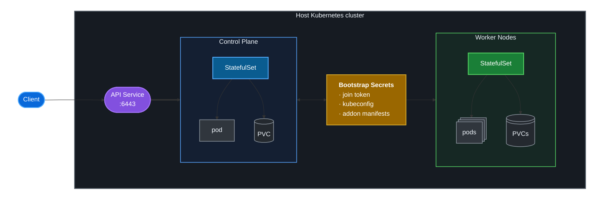

# `knested`: a minimalist way to deploy Kubernetes in Kubernetes

This project deploys Kubernetes into Kubernetes, akin to kind on Docker. Instead of using a container
runtime as a host for the whole cluster, resulting in a large VM or container, knested creates one pod
per node, making clusters of any size easier to deploy.

Each control-plane and worker node has its own container runtime inside its node pod. The nested
cluster has a separate API server, etcd, kubelets and container runtime; the host cluster schedules
the node pods using StatefulSets along with a small set of Services, Secrets, RBAC objects and persistent
volumes that make up the deployment. knested does not access any API resources in the host cluster
aside from specific secrets used for bootstrap. It has no CRD or cloud prover dependencies.

knested is comparable to vCluster, but there are a few key distinctions:
  - no synchronisation with the host cluster
  - full API isolation
  - knested owns its Kubernetes version, node runtime and CNI
      - independent of what host cluster runs
  - much simpler model: all knested nodes are pods in host cluster
      - no private or shared nodes
  - multiplexing: a very large single host node can many multi-node knested clusters

The node pods can run as ordinary containers or use a VM-based runtime.
Cilium is the default CNI, using another CNI should be possible, but may require testing.

## Deployment topology



## Walkthrough


To deploy a cluster you need [Timoni](https://timoni.sh). You can run the cluster on top of kind.

```
git clone https://github.com/errordeveloper/knested
cd knested
timoni apply --namespace test-cluster tc-1
```

Here is what the output will look like:
```
$ timoni apply --namespace test-cluster tc-1 .
11:44AM INF i:tc-1 > building .
11:44AM INF i:tc-1 > using module github.com/errordeveloper/knested version 0.0.0-devel
11:44AM INF i:tc-1 > installing tc-1 in namespace test-cluster
11:44AM INF i:tc-1 > Namespace/test-cluster created
11:44AM INF i:tc-1 > ServiceAccount/test-cluster/tc-1-cp created
11:44AM INF i:tc-1 > ServiceAccount/test-cluster/tc-1-node created
11:44AM INF i:tc-1 > Role/test-cluster/tc-1-cp created
11:44AM INF i:tc-1 > Role/test-cluster/tc-1-node created
11:44AM INF i:tc-1 > RoleBinding/test-cluster/tc-1-cp created
11:44AM INF i:tc-1 > RoleBinding/test-cluster/tc-1-node created
11:44AM INF i:tc-1 > Secret/test-cluster/tc-1-join-token created
11:44AM INF i:tc-1 > Secret/test-cluster/tc-1-kubeconfig created
11:44AM INF i:tc-1 > Service/test-cluster/tc-1 created
11:44AM INF i:tc-1 > StatefulSet/test-cluster/tc-1-cp created
11:44AM INF i:tc-1 > StatefulSet/test-cluster/tc-1-node created
11:47AM INF i:tc-1 > resources are ready
$ kubectl exec -ti -n test-cluster statefulset/tc-1-cp -- kubectl get nodes
NAME                         STATUS   ROLES           AGE     VERSION
tc-1-cp-0                    Ready    control-plane   7m1s    v1.30.12
tc-1-node-0                  Ready    <none>          6m12s   v1.30.12
$ kubectl exec -ti -n test-cluster statefulset/tc-1-cp -- kubectl get pods -n kube-system
NAME                                               READY   STATUS    RESTARTS   AGE
cilium-7dw7j                                       1/1     Running   0          6m24s
cilium-n6j5q                                       1/1     Running   0          7m3s
cilium-operator-7754954889-pw6dv                   1/1     Running   0          7m2s
cilium-operator-7754954889-zlrc4                   1/1     Running   0          7m2s
coredns-7db6d8ff4d-7c649                           1/1     Running   0          7m2s
coredns-7db6d8ff4d-7tj8g                           1/1     Running   0          7m2s
etcd-tc-1-cp-0                                     1/1     Running   0          7m11s
kube-apiserver-tc-1-cp-0                           1/1     Running   0          7m11s
kube-controller-manager-tc-1-cp-0                  1/1     Running   0          7m11s
kube-proxy-f6zd6                                   1/1     Running   0          6m24s
kube-proxy-skfwv                                   1/1     Running   0          7m3s
kube-scheduler-tc-1-cp-0                           1/1     Running   0          7m11s
$
```

The kubeconfig for this cluster can be accessed from a secret:

```
$ kubectl get secrets -n test-cluster tc-1-kubeconfig
NAME              TYPE     DATA   AGE
tc-1-kubeconfig   Opaque   1      10m
$
```

There is a handy script that can port-forward the API endpoint and setup local kubeconfig:
```
$ ./scripts/access-cluster.sh test-cluster tc-1

starting new shell for test-cluster/tc-1 with KUBECONFIG set

[test-cluster/tc-1] $ kubectl get nodes
NAME          STATUS   ROLES           AGE   VERSION
tc-1-cp-0     Ready    control-plane   12m   v1.30.12
tc-1-node-0   Ready    <none>          11m   v1.30.12
[test-cluster/tc-1] $
```

To cleanup you can just run `kubectl delete ns test-cluster`.

If you just want to see how it works, check out the following directories:
- [`cluster/`](cluster): for CUE configs
- [`images/kubeadm-ubuntu/`](images/kubeadm-ubuntu): for image builds

To inspect the resources without applying them, see the generated
[`test-cluster.yaml`](test-cluster.yaml). Refresh it for the default values with:

```
make test-cluster.yaml
```

Set `NAMESPACE` to render the example for a different namespace.

## Prerequisites

- A Kubernetes cluster with Linux nodes that permits the privileged node pods and their required host mounts.
- A storage class that can dynamically provision `ReadWriteOnce` PVCs; each node pod requests 5 GiB.
- Capacity for the defaults: 2 CPU and 5200 MiB for the control plane, plus 2 CPU and 8200 MiB per worker.
- [Timoni](https://timoni.sh) to deploy the module and `kubectl` to operate the host cluster. The access script also requires `jq`.

## Configuration

The default values are in [`values.cue`](values.cue); the complete schema is in [`cluster/config.cue`](cluster/config.cue).

| Setting | Default |
| --- | --- |
| Control-plane replicas | `1` (fixed) |
| Worker replicas | `1` |
| Service type | `ClusterIP` |
| Node image | pinned kubeadm image for Kubernetes `1.30.12` |
| RuntimeClass | _unset_ |
| Sonobuoy conformance test | _disabled_ |

Node and control-plane resource requests and limits, the Service type, image pull secrets, RuntimeClass,
placement settings and optional extra manifests can all be configured through module values. Cilium bootstrap
manifests are bundled under [`manifests/`](manifests/); use [`scripts/import-cilium.sh`](scripts/import-cilium.sh)
to import a different Cilium chart version, then update the Cilium import in [`cluster/config.cue`](cluster/config.cue).

To deploy a cluster you need Timoni. You can run it on top of kind too!
```
git clone https://github.com/errordeveloper/knested
cd knested
timoni apply --namespace test-cluster tc-1 .
```
